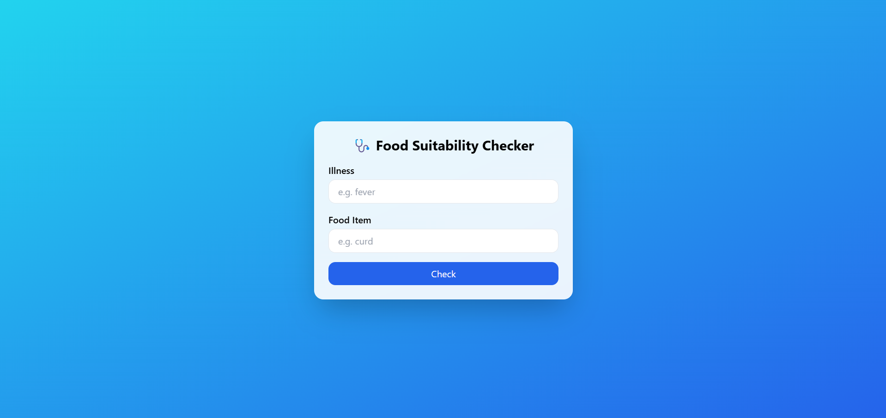

# health-food-ai

> An AI-powered assistant that tells you if a food item is safe to eat based on your current illness (e.g., sore throat, fever, constipation).

---

## Project Screenshot (Initial)



## ✅ Features

- 🔍 Food safety analysis based on symptoms or health conditions
- 📊 AI-powered decision using Hugging Face zero-shot classification
- 🧠 Learns from real-world food-health compatibility data
- 🌐 API-ready backend with FastAPI
- 💬 Future support for image input, meal tracking, and dietary planning

---

## 🧠 How it Works

- You tell it what you're suffering from (e.g. fever)
- You input a food item (e.g. ice cream)
- The model classifies whether it's **safe to eat** or **risky**
- Response includes confidence score and reasoning (coming soon)

---

## 🚀 Setup (Local Dev)

```bash
git clone https://github.com/yourusername/health-food-ai.git
cd health-food-ai/backend
python -m venv venv
source venv/bin/activate     # or venv\Scripts\activate (Windows)
pip install -r requirements.txt
uvicorn app:app --reload
```
